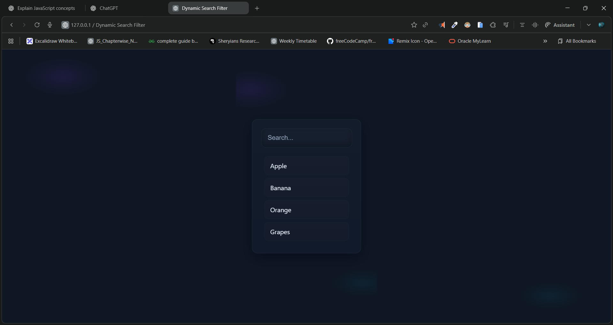

# 🌐 Dynamic Search Filter

A sleek and responsive **real-time search filter** built with **HTML, CSS & JavaScript**.
Automatically filters items as the user types, with smooth animations and a modern glass-UI design.

---

## 📸 Preview




---

## 🔗 Live Demo

> 👉 **Live Site:** [https://dileep-kumawat.github.io/Dynamic-search-filter-using-html-css-and-js/](https://dileep-kumawat.github.io/Dynamic-search-filter-using-html-css-and-js/)

---

## 🎥 Demo Video

> 🎬 **Watch Demo:** [click to watch](./demo.mp4)

---

## 📁 Project Structure

```
📦 Dynamic Search Filter
├── index.html      # Main HTML structure  
├── style.css       # Modern glass UI styling  
└── script.js       # Search filter logic  
```

---

## ✨ Features

✔️ Real-time search filtering
✔️ Smooth animations and transitions
✔️ Glass-morphism UI
✔️ “No results found” state
✔️ Clean and lightweight — no libraries needed

---

## 🚀 How It Works

The script filters through an array of items (`Apple`, `Banana`, `Orange`, `Grapes`)
and updates the list dynamically as the user types.

```js
filteredItems = items.filter((e) => {
    return e.toLowerCase().includes(inp.value.toLowerCase());
});
```

When no matches are found, it displays:

```
No results found
```

---

## 🛠️ Technologies Used

* **HTML5**
* **CSS3** (Glass UI, animations, responsive)
* **JavaScript** (Dynamic filtering)

---

## 📦 Installation / Setup

Clone the project:

```sh
git clone https://github.com/Dileep-kumawat/Dynamic-search-filter-using-html-css-and-js.git
```

Open `index.html` in your browser — no build tools required.

---

## 🧑‍💻 Author

👤 **Dileep kumawat**
- 📧 [dileepkumawat525@gmail.com](mailto:dileepkumawat525@gmail.com)
- 🔗 [LinkedIn](https://www.linkedin.com/in/dileep-kumawat/)

---

## 📜 License

This project is open-source. Feel free to use or modify it.
